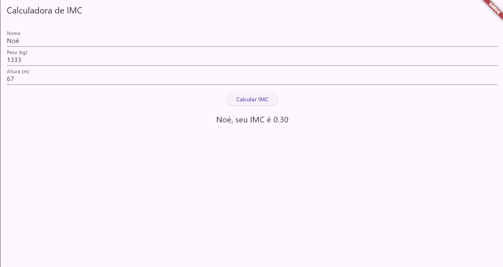

# Calculadora de IMC

This is a basic Body Mass Index (BMI) calculator app built with Flutter.

**Features**

* Calculates BMI based on weight and height
* User can input their name for personalized results

**How to use the app**

1. Clone or download the repository.
2. Ensure you have Flutter installed and configured on your development machine (https://docs.flutter.dev/get-started/install).
3. Open the project in your preferred code editor.
4. Run the app using `flutter run`.

**Understanding the Code**

The code consists of three main classes:

* `MyApp`: This class sets up the MaterialApp widget, which is the root widget of the app.
* `MyHomePage`: This class manages the state of the app's UI elements.
* `Pessoa`: This class represents a person with properties for name, weight, and height. It also includes a method to calculate BMI.

**Screenshots**

**Notes**

* This is a simple example and does not provide any medical interpretation of BMI results.
* For health and safety reasons, it's recommended to consult a healthcare professional for guidance on interpreting BMI.

**Contributing**

Pull requests are welcome! Please see the CONTRIBUTING.md file for guidelines (create a CONTRIBUTING.md file if you don't have one yet).
